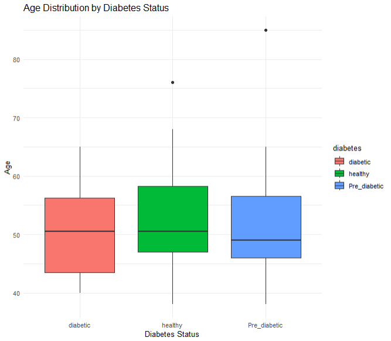
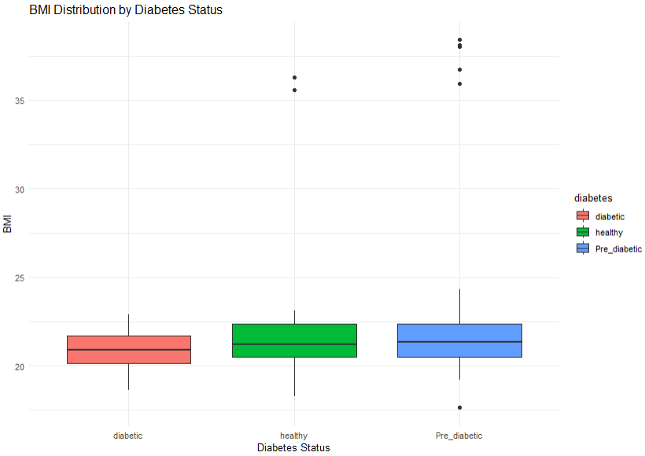
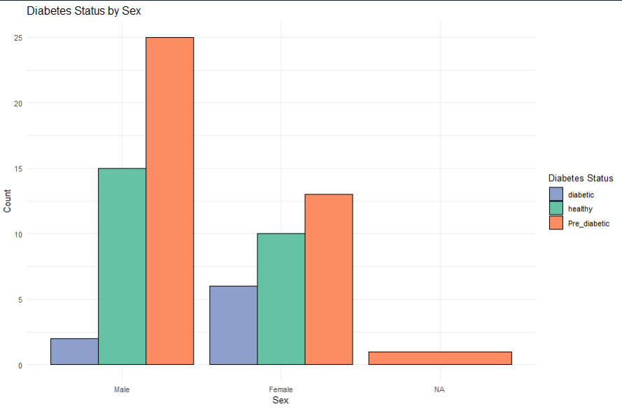
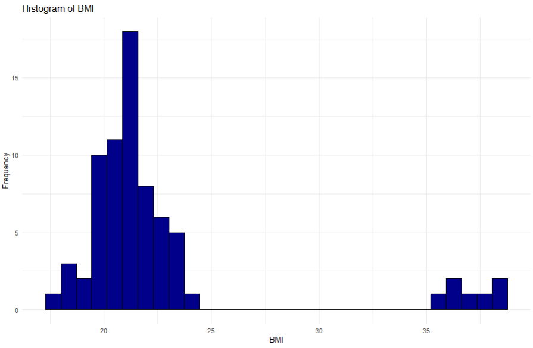

# School R Projects Repository 🎓

This repository contains my coursework and assignments for **Epidemiology & Data Analysis in R**.  
It includes introductory R exercises, standardization, and applied data science projects using real-world health datasets.  

---

## 📂 Contents

1. **Practice 1: Introduction to R**  
   File: [`Practice_1_Introduction_to_R.R`](./Practice_1_Introduction_to_R.R)  
   - Basic arithmetic and functions in R.  
   - Introduction to operators, logs, exponents, and variables.  

2. **Standardization Assignment**  
   File: [`standardization_assignment.R`](./standardization_assignment.R)  
   - Direct standardization methods.  
   - Use of population and rates in comparative epidemiology.  

3. **Lapland Dataset Analysis**  
   File: [`lapland.csv`](./lapland.csv)  
   - Computed **BMI** from height and weight.  
   - Descriptive statistics of BMI by sex.  
   - Diabetes prevalence across age, sex, and BMI.  
   - Visualizations:  
     - Diabetes distribution by age  
     - Diabetes distribution by BMI  
     - Diabetes distribution by sex  
     - Histogram of BMI  

   ### Example Outputs
     
     
     
     

4. **Hospital Readmission (Diabetes Dataset)**  
   File: [`diabetic_data.csv`](./my_projects/diabetic_data.csv)  
   - Cleaned dataset with 100K+ hospital encounters.  
   - Missing data handling (`weight`, `payer_code`).  
   - Distribution of patient age, gender, and readmission rates.  
   - Analysis of medications vs. readmission.  

---

## 🚀 How to Run  
Clone the repo and open RStudio:  

```R
# Load libraries
library(readr)
library(dplyr)
library(ggplot2)

# Run scripts
source("Practice_1_Introduction_to_R.R")
source("standardization_assignment.R")
🧾 Notes

Graphs are saved in the images/ folder for easy viewing.

Each script is well-commented to explain reasoning.

Useful for practicing epidemiology, data cleaning, and statistical analysis with R.

✍️ Prepared by: Edeko Eromosele Ethan
