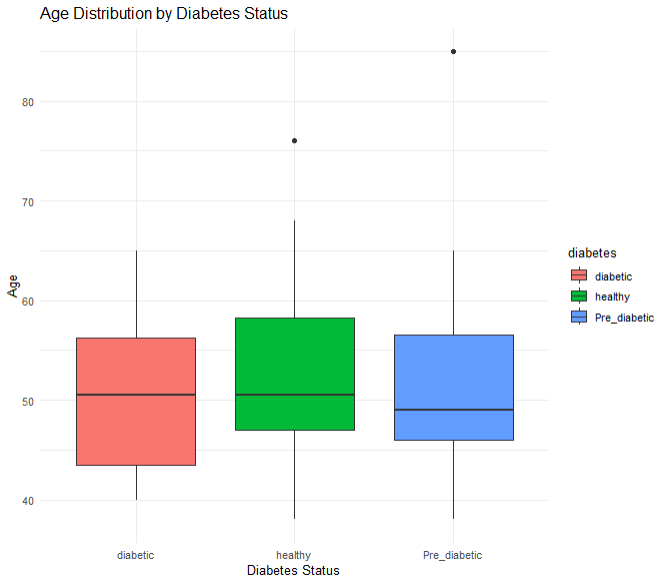
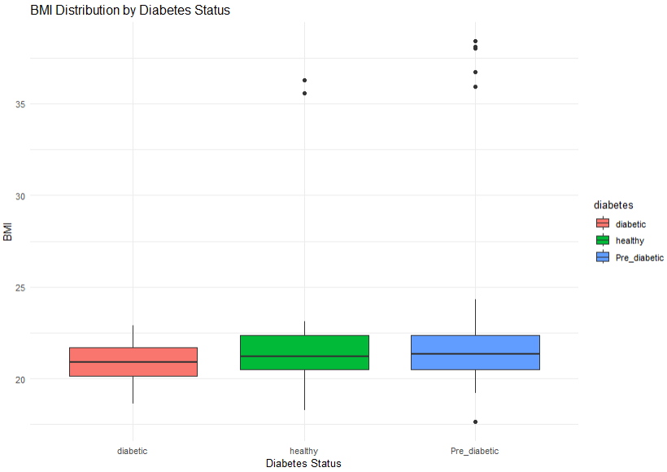
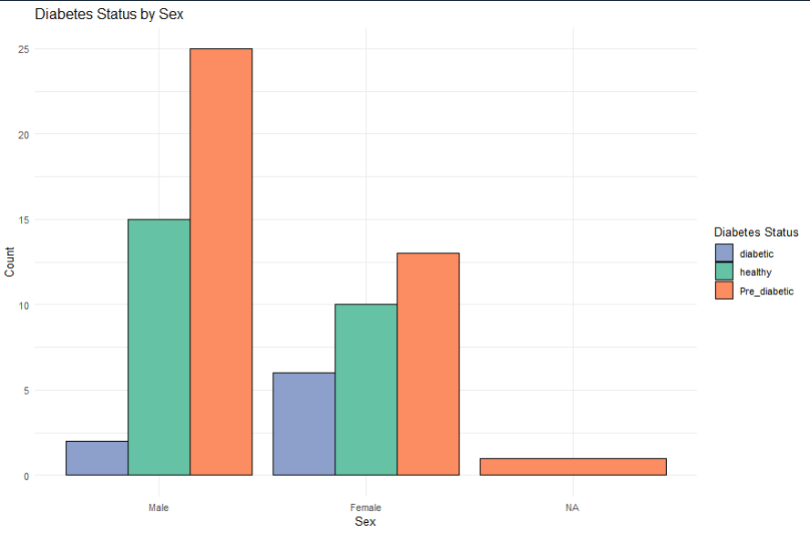
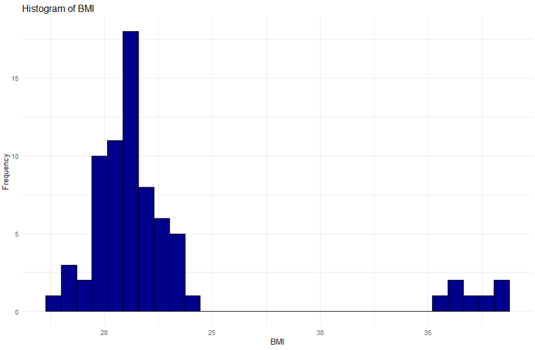

# School R Projects Repository 🎓

This repository contains my coursework and assignments for **Epidemiology & Data Analysis in R**.  
It includes introductory R exercises, standardization, and applied data science projects using real-world health datasets.  

---

## 📂 Contents

1. **Practice 1: Introduction to R**  
   File: [`Practice_1_Introduction_to_R.R`](./Practice_1_Introduction_to_R.R)  
   - Basic arithmetic and functions in R.  
   - Introduction to operators, logs, exponents, and variables.  

2. **Standardization Assignment**  
   File: [`standardization_assignment.R`](./standardization_assignment.R)  
   - Direct standardization methods.  
   - Use of population and rates in comparative epidemiology.  

3. **Lapland Dataset Analysis**  
   File: [`lapland.csv`](./lapland.csv)  
   - Computed **BMI** from height and weight.  
   - Descriptive statistics of BMI by sex.  
   - Diabetes prevalence across age, sex, and BMI.  
   - Visualizations:  
     - Diabetes distribution by age  
     - Diabetes distribution by BMI  
     - Diabetes distribution by sex  
     - Histogram of BMI  

   ### Example Outputs
     
     
     
     

4. **Assignment 3**  
   - **Research Question:**  
      A researcher is interested in comparing BMI between individuals with COPD and healthy individuals. She claims that BMI differs between these two groups.  

     - **Tasks:**  
      - a) Define the null and alternative hypotheses.  
      - b) Choose the most appropriate statistical test for this hypothesis.  
      - c) Run the test and interpret the results.  
      - *Hint: Carefully consider the assumptions of the chosen test.*  

   - **File:** [`eromosele.edeko2.R`](./eromosele.edeko2.R)

       
     
   
5. **Assignment 3B**  
   A survey of 175 young adults classified their highest level of schooling as either "graduated from university," "graduated from high school," or "neither." Their parents were classified as "wealthy," "middle class," or "poor." The results are summarized in Table 1 (Observed Values).  

   **Question:**  
   Based on the data collected, can we conclude that a person’s level of schooling is independent of their parents’ wealth?  

   **Tasks:**  
   - a) Perform a Chi-Square Test manually.  

   |                | Univ | High Sch | None | Total |
   |----------------|------|----------|------|-------|
   | **Wealthy**    |  20  |    15    |  10  |  45   |
   | **Middle class** |  40  |    25    |  20  |  85   |
   | **Poor**       |   8  |    14    |  23  |  45   |
   | **Total**      |  68  |    54    |  53  | 175   |


---

## 🚀 How to Run  
Clone the repo and open RStudio:  

```R
# Load libraries
library(readr)
library(dplyr)
library(ggplot2)

# Run scripts
source("Practice_1_Introduction_to_R.R")
source("standardization_assignment.R")
🧾 Notes

Graphs are saved in the images/ folder for easy viewing.

Each script is well-commented to explain reasoning.

Useful for practicing epidemiology, data cleaning, and statistical analysis with R.

✍️ Prepared by: Edeko Eromosele Ethan
